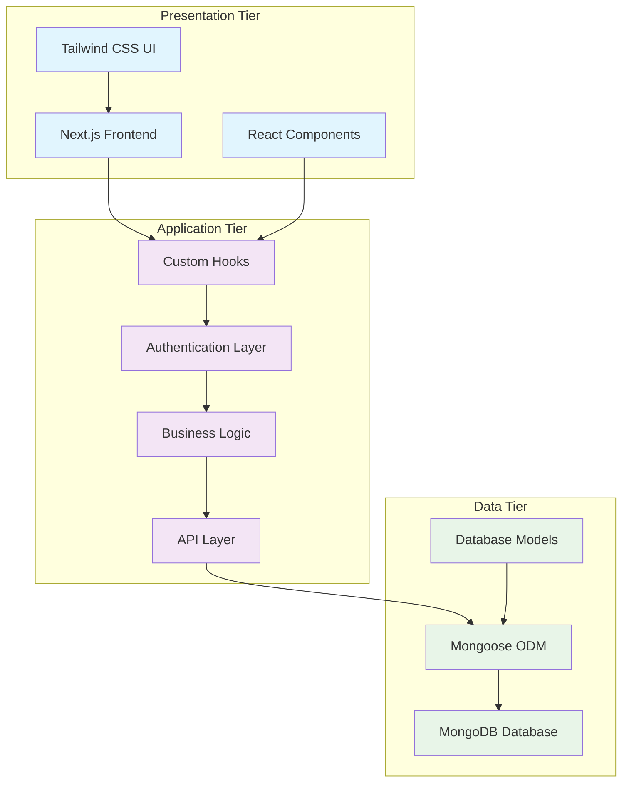
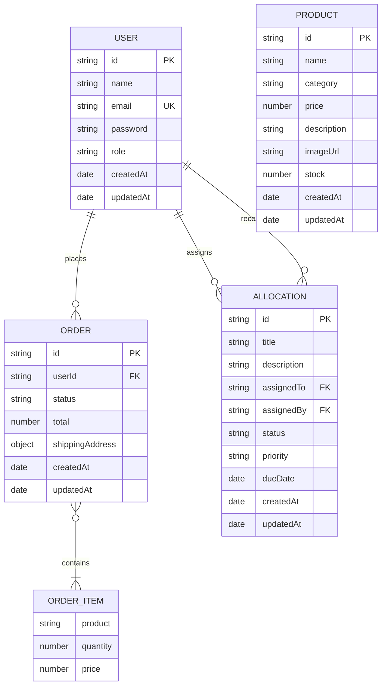
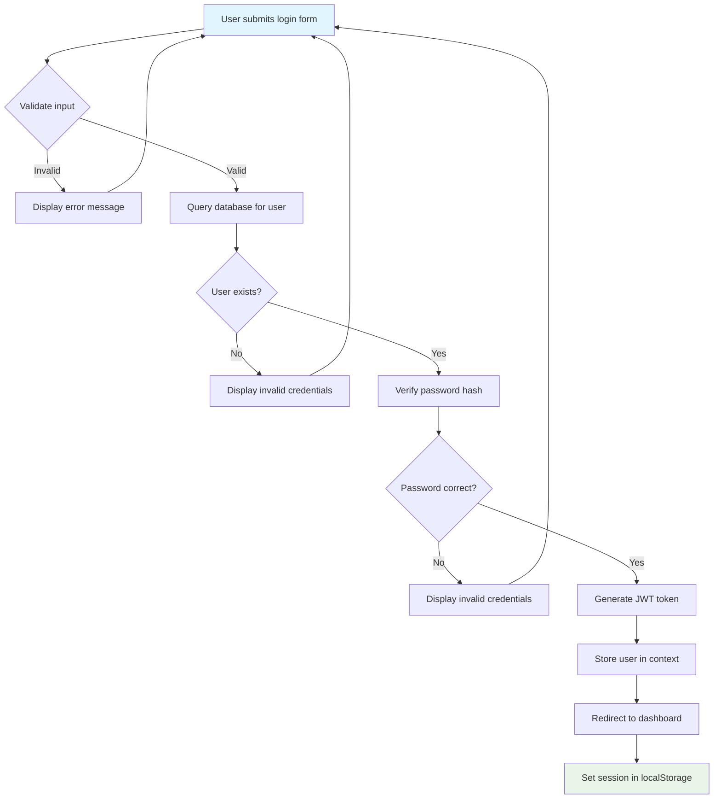
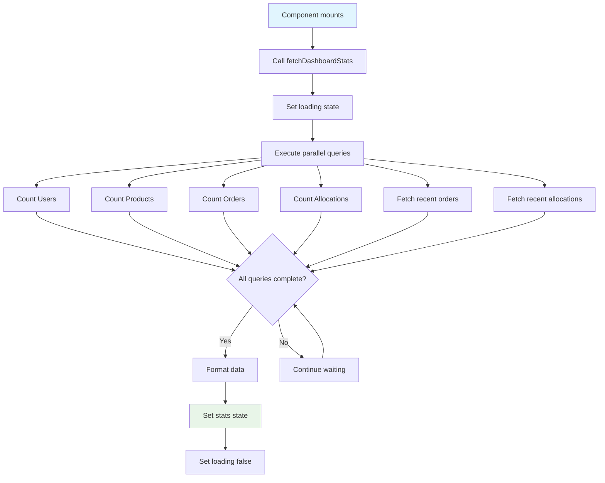
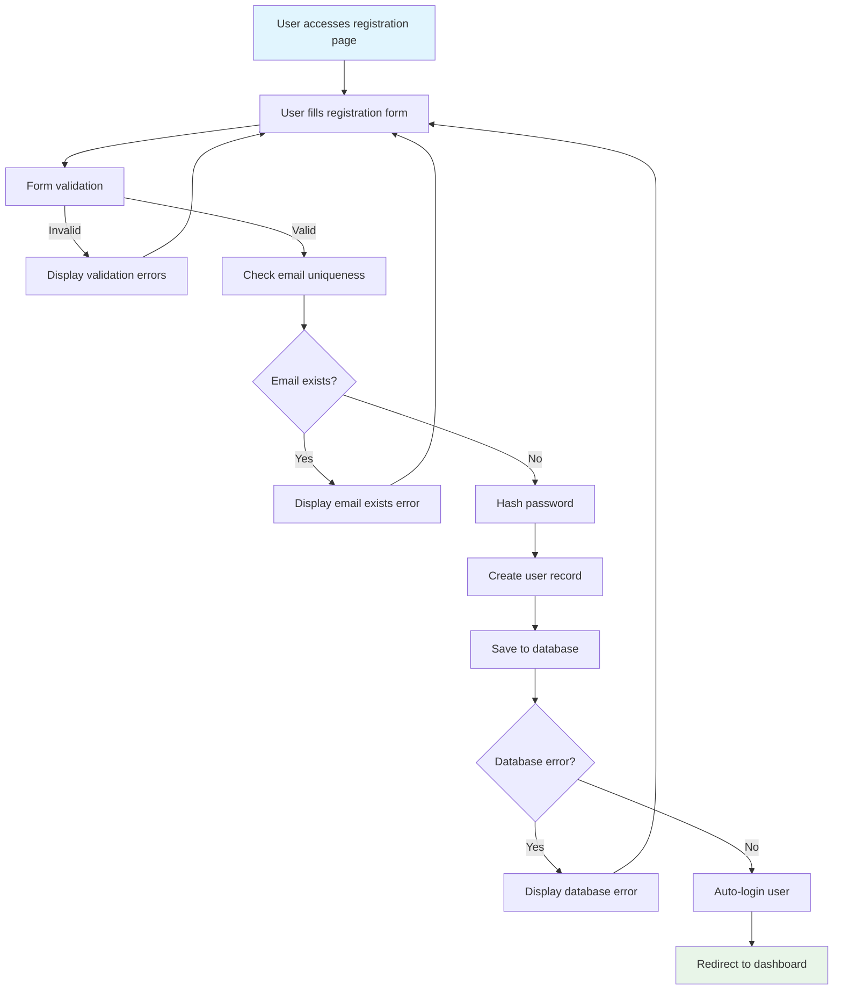
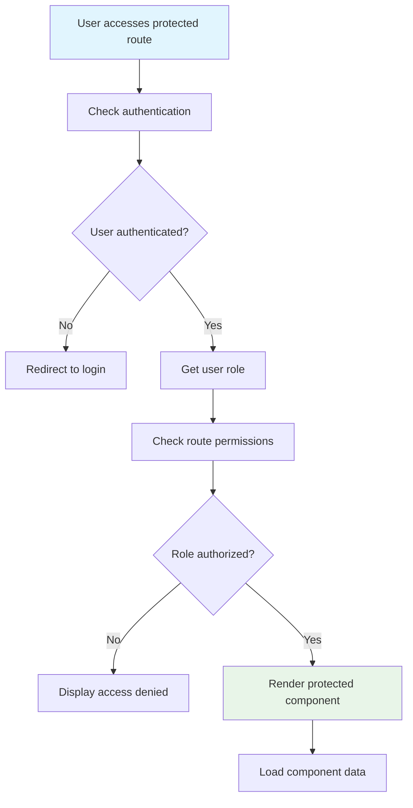

# CHAPTER FOUR: SYSTEM DESIGN AND IMPLEMENTATION

## 4.1 Objective of Design

The primary objective of the Emzor Pharmaceutical Distribution System design is to create a robust, secure, and scalable web-based application that facilitates efficient management of pharmaceutical distribution processes. The system is designed to address the following key objectives:

### 4.1.1 Functional Objectives
- **Multi-Role Authentication**: Implement a secure authentication system supporting three distinct user roles (Admin, Supervisor, Student) with role-based access control
- **Real-Time Data Management**: Provide live data synchronization between the frontend and MongoDB database
- **CRUD Operations**: Enable complete Create, Read, Update, and Delete operations across all system entities
- **Responsive User Interface**: Design an intuitive and responsive interface that works across multiple devices

### 4.1.2 Non-Functional Objectives
- **Security**: Implement JWT-based authentication with bcrypt password hashing
- **Performance**: Optimize database queries and implement efficient data fetching mechanisms
- **Scalability**: Design a modular architecture that can accommodate future enhancements
- **Maintainability**: Structure the codebase with reusable components and clear separation of concerns

### 4.1.3 System Scope
The system encompasses user management, product inventory, order processing, and task allocation functionalities, providing a comprehensive solution for pharmaceutical distribution management.

## 4.2 System Architecture in Terms of Tiers

The Emzor Pharmaceutical Distribution System follows a three-tier architecture pattern, ensuring clear separation of concerns and maintainability. Figure 4.1 illustrates the system architecture.



**Figure 4.1: System Architecture Diagram**

### 4.2.1 Presentation Tier
The presentation tier consists of:
- **Next.js Frontend**: Server-side rendered React application
- **React Components**: Modular UI components for different functionalities
- **Tailwind CSS**: Utility-first CSS framework for responsive design

### 4.2.2 Application Tier
The application tier includes:
- **Custom Hooks**: Reusable React hooks for state management and data fetching
- **Authentication Layer**: JWT-based authentication with role management
- **Business Logic**: Core application logic and data processing
- **API Layer**: Interface between frontend and database operations

### 4.2.3 Data Tier
The data tier comprises:
- **MongoDB Database**: NoSQL database for flexible data storage
- **Mongoose ODM**: Object Data Modeling for MongoDB
- **Database Models**: Structured schemas for Users, Products, Orders, and Allocations

## 4.3 Choice of Programming Environment

### 4.3.1 Frontend Technologies
The system utilizes modern web technologies selected for their performance, scalability, and developer experience:

**Next.js 14.2.32**
- Server-side rendering for improved performance
- Built-in TypeScript support
- Automatic code splitting and optimization
- API routes for backend functionality

**React 18**
- Component-based architecture
- Virtual DOM for efficient rendering
- Hooks for state management
- Context API for global state

**TypeScript**
- Static type checking
- Enhanced developer experience
- Better code maintainability
- Reduced runtime errors

### 4.3.2 Backend Technologies
**MongoDB 6.7.0 with Mongoose 8.4.4**
- Flexible document-based data structure
- High performance and scalability
- Rich query capabilities
- Mongoose for schema validation and data modeling

**Authentication & Security**
- **jsonwebtoken 9.0.2**: JWT token generation and verification
- **bcryptjs 2.4.3**: Secure password hashing
- **Environment Variables**: Secure configuration management

### 4.3.3 Development Tools
**Build Tools**
- ESLint for code quality
- PostCSS for CSS processing
- Tailwind CSS for styling
- TypeScript compiler

**UI/UX Libraries**
- Lucide React for icons
- Class Variance Authority for component variants
- Tailwind Merge for utility class management

## 4.4 Database Structure

The system employs a NoSQL MongoDB database with four main collections. Figure 4.2 shows the database schema relationships.



**Figure 4.2: Database Schema Diagram**

### 4.4.1 Database Collections

**Users Collection**
- Stores user account information and authentication data
- Supports role-based access control (Admin, Supervisor, Student)
- Indexed on email for efficient lookups

**Products Collection**
- Contains pharmaceutical product catalog
- Includes inventory tracking with stock levels
- Supports categorization for easy browsing

**Orders Collection**
- Manages customer order information
- Tracks order status through lifecycle
- Links to users and order items

**Allocations Collection**
- Handles task assignment between supervisors and students
- Tracks task progress and priority levels
- Maintains assignment history

## 4.5 Database Table Definition

### 4.5.1 Users Table Schema
```javascript
const userSchema = new mongoose.Schema({
  id: { type: String, required: true, unique: true },
  name: { type: String, required: true },
  email: { type: String, required: true, unique: true },
  password: { type: String, required: true },
  role: {
    type: String,
    required: true,
    enum: ['ADMIN', 'SUPERVISOR', 'STUDENT']
  },
  createdAt: { type: Date, default: Date.now },
  updatedAt: { type: Date, default: Date.now }
});
```

### 4.5.2 Products Table Schema
```javascript
const productSchema = new mongoose.Schema({
  id: { type: String, required: true, unique: true },
  name: { type: String, required: true },
  category: { type: String, required: true },
  price: { type: Number, required: true },
  description: { type: String, required: true },
  imageUrl: { type: String, required: true },
  stock: { type: Number, default: 0 },
  createdAt: { type: Date, default: Date.now },
  updatedAt: { type: Date, default: Date.now }
});
```

### 4.5.3 Orders Table Schema
```javascript
const orderSchema = new mongoose.Schema({
  id: { type: String, required: true, unique: true },
  userId: { type: String, required: true },
  items: [{
    product: {
      id: String,
      name: String,
      category: String,
      price: Number,
      description: String,
      imageUrl: String
    },
    quantity: Number,
    price: Number
  }],
  total: { type: Number, required: true },
  status: {
    type: String,
    required: true,
    enum: ['PENDING', 'CONFIRMED', 'SHIPPED', 'DELIVERED', 'CANCELLED'],
    default: 'PENDING'
  },
  shippingAddress: {
    fullName: String,
    phone: String,
    address: String,
    city: String,
    state: String,
    postalCode: String
  },
  createdAt: { type: Date, default: Date.now },
  updatedAt: { type: Date, default: Date.now }
});
```

### 4.5.4 Allocations Table Schema
```javascript
const allocationSchema = new mongoose.Schema({
  id: { type: String, required: true, unique: true },
  title: { type: String, required: true },
  description: { type: String, required: true },
  assignedTo: { type: String, required: true },
  assignedBy: { type: String, required: true },
  status: {
    type: String,
    required: true,
    enum: ['PENDING', 'IN_PROGRESS', 'COMPLETED', 'CANCELLED'],
    default: 'PENDING'
  },
  priority: {
    type: String,
    required: true,
    enum: ['LOW', 'MEDIUM', 'HIGH'],
    default: 'MEDIUM'
  },
  dueDate: Date,
  createdAt: { type: Date, default: Date.now },
  updatedAt: { type: Date, default: Date.now }
});
```

## 4.6 Input and Output Screen Format

### 4.6.1 Login Screen
**Input Elements:**
- Email field (text input, required, email validation)
- Password field (password input, required, minimum 6 characters)
- Role-based authentication flow

**Output Elements:**
- Success message on successful login
- Error messages for invalid credentials
- Role-based redirection to appropriate dashboard

### 4.6.2 Registration Screen
**Input Elements:**
- Full name field (text input, required)
- Email field (email input, required, unique validation)
- Role selection dropdown (required)
- Password field (password input, required, minimum 6 characters)
- Confirm password field (password input, required, matching validation)

**Output Elements:**
- Success message on successful registration
- Error messages for validation failures
- Duplicate email error handling

### 4.6.3 Admin Dashboard Screen
**Input Elements:**
- Search and filter controls for user/product management
- Form inputs for creating/editing users and products
- Status update dropdowns for orders

**Output Elements:**
- Real-time statistics display
- Data tables with pagination
- System status indicators
- Recent activity feeds

## 4.7 Program Algorithm

### 4.7.1 Authentication Algorithm


**Figure 4.3: Authentication Flowchart**

### 4.7.2 Dashboard Data Fetching Algorithm


**Figure 4.4: Dashboard Data Fetching Algorithm**

## 4.8 Program Flowcharts

### 4.8.1 User Registration Flowchart


**Figure 4.5: User Registration Flowchart**

### 4.8.2 Role-Based Access Control Flowchart


**Figure 4.6: Role-Based Access Control Flowchart**

## 4.9 Hardware Requirements

### 4.9.1 Server Requirements
- **Processor**: Intel Core i5 or equivalent (minimum 4 cores recommended)
- **Memory**: 8GB RAM minimum, 16GB recommended for production
- **Storage**: 50GB SSD minimum for database and application files
- **Network**: Stable internet connection with minimum 10 Mbps bandwidth

### 4.9.2 Client Requirements
- **Browser Compatibility**: Chrome 90+, Firefox 88+, Safari 14+, Edge 90+
- **Screen Resolution**: Minimum 1024x768, recommended 1920x1080
- **Memory**: 4GB RAM minimum
- **Storage**: 1GB free space for caching

### 4.9.3 Database Server Requirements
- **MongoDB Version**: 6.0 or higher
- **Processor**: Multi-core processor recommended
- **Memory**: 16GB RAM minimum for production workloads
- **Storage**: SSD storage with sufficient space for data growth
- **Network**: Low-latency connection to application server

## 4.10 Software Requirements

### 4.10.1 Operating System
- **Server**: Ubuntu 20.04 LTS or Windows Server 2019+
- **Development**: Windows 10+, macOS 11+, or Linux distributions
- **Database**: Cross-platform compatibility with MongoDB

### 4.10.2 Runtime Environment
- **Node.js**: Version 18.0 or higher
- **npm**: Version 8.0 or higher
- **MongoDB**: Version 6.0 or higher
- **Git**: Version 2.30 or higher for version control

### 4.10.3 Development Tools
- **Code Editor**: Visual Studio Code, IntelliJ IDEA, or similar
- **Package Manager**: npm or yarn
- **Build Tools**: Next.js CLI, TypeScript compiler
- **Testing**: React Testing Library, Jest (optional)

## 4.11 Documentation

### 4.11.1 User Documentation
- **Installation Guide**: Step-by-step setup instructions
- **User Manual**: Role-specific functionality guides
- **Troubleshooting Guide**: Common issues and solutions
- **API Documentation**: Frontend API integration details

### 4.11.2 Technical Documentation
- **System Architecture**: Detailed technical specifications
- **Database Schema**: Complete data model documentation
- **Code Documentation**: Inline code comments and JSDoc
- **Deployment Guide**: Production deployment procedures

### 4.11.3 Maintenance Documentation
- **Update Procedures**: System update and maintenance processes
- **Backup Procedures**: Database and system backup guidelines
- **Security Guidelines**: Security best practices and procedures
- **Performance Monitoring**: System performance tracking methods
